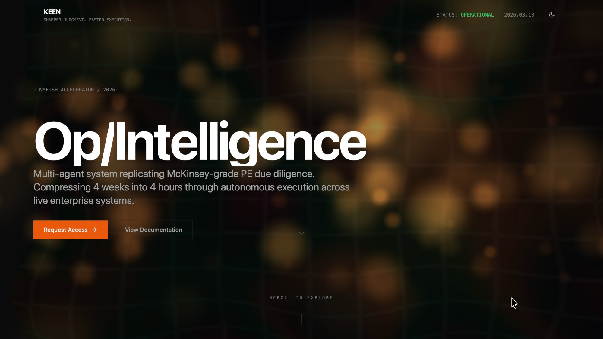
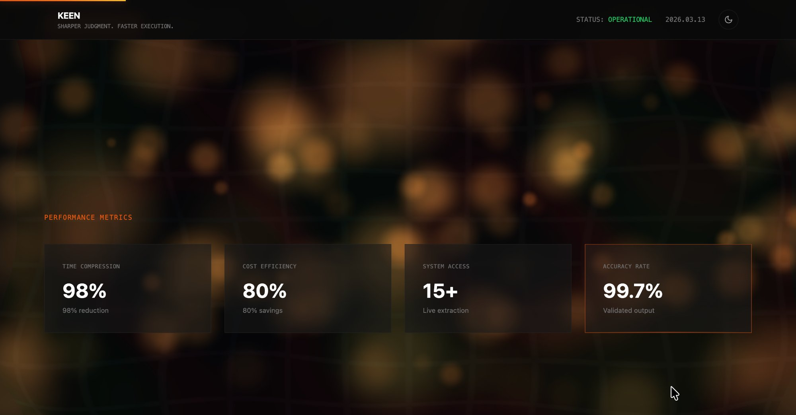
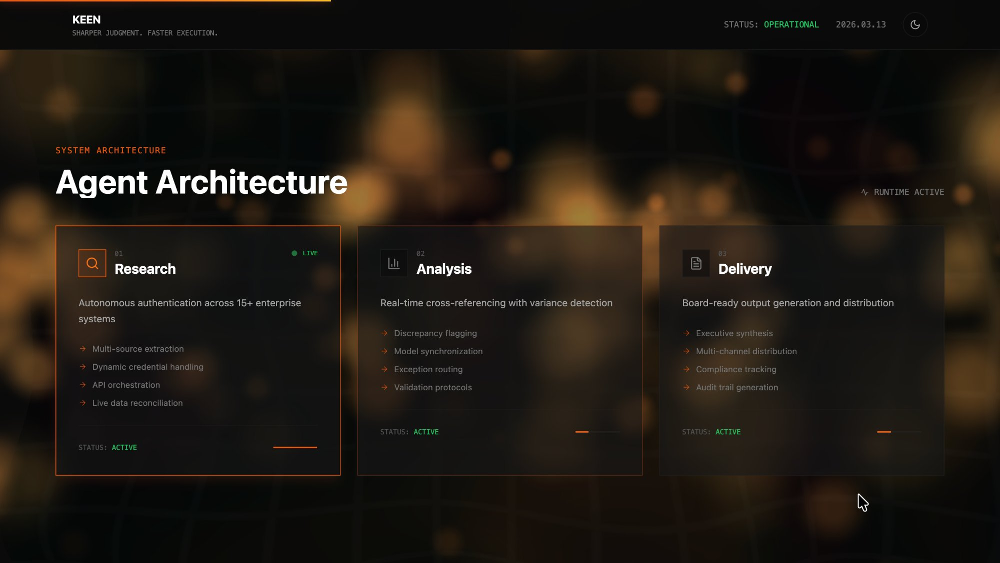
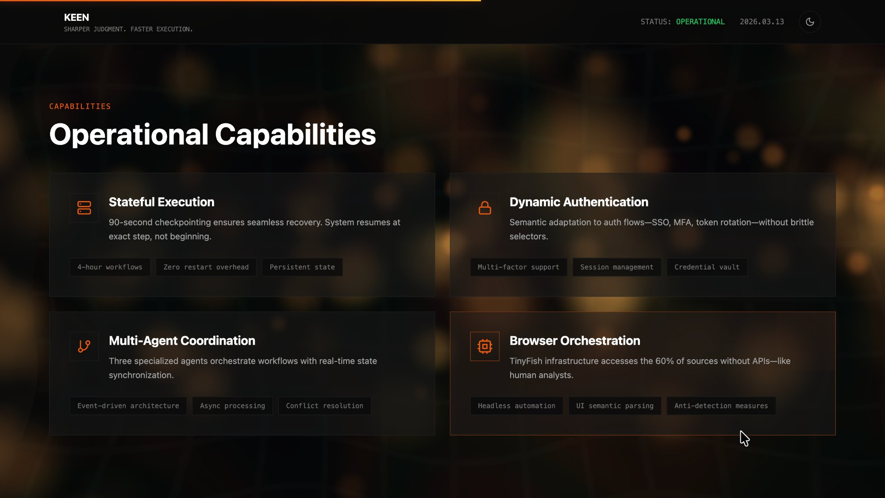
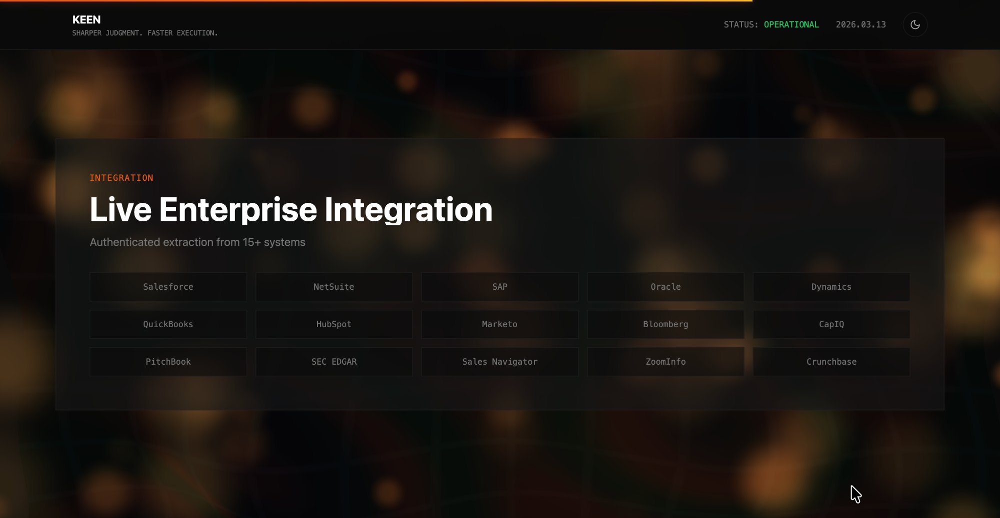
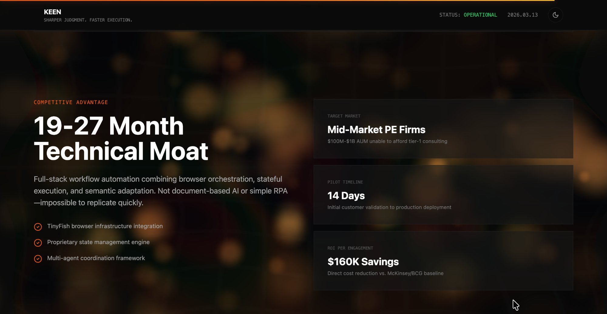

# KEEN

**Sharper Judgment. Faster Execution.**

KEEN is a multi-agent operational intelligence platform designed to replicate McKinsey-grade private equity due diligence — compressing weeks of manual research into hours through autonomous orchestration across live enterprise systems.

> ⚠️ **Status:** KEEN is under active development as part of the **TinyFish Accelerator (2026)**. Performance targets below reflect design goals; benchmarks will be published as the platform matures.

---

## 📸 Screenshots

| Hero | Performance Metrics |
|---|---|
|  |  |

| Agent Architecture | Operational Capabilities |
|---|---|
|  |  |

| Enterprise Integrations | Competitive Advantage |
|---|---|
|  |  |

> 🌐 Live demo: [keen-sigma.vercel.app](https://keen-sigma.vercel.app)

---

## 🎯 Design Targets

| Metric | Target |
|---|---|
| **Time compression** | 4 weeks → ~4 hours |
| **Cost reduction** | ~80% vs. traditional PE diligence |
| **Data sources** | 15+ live enterprise systems |
| **Output accuracy** | Validated findings with confidence scoring |

These are architectural targets based on the scope of automation, not yet validated on live engagements. The platform is designed to eliminate the manual extraction, normalization, and cross-referencing that accounts for the majority of traditional diligence time.

---

## ✨ How It Works

KEEN orchestrates three autonomous agents in sequence. Each agent hands off structured output to the next, with full checkpointing and resume support at every step.

```
Research Agent → Analysis Agent → Delivery Agent
```

### 1. Research Agent
Authenticates to and extracts data from 15+ enterprise systems. Each source goes through two steps: `authenticate_{source}` then `extract_{source}`. Supported auth modes include OAuth (Salesforce, Dynamics, QuickBooks), API key (HubSpot, ZoomInfo, Crunchbase), SSO/MFA (SAP), browser automation via TinyFish (Bloomberg, PitchBook, Capital IQ), and public access (SEC EDGAR).

Sources are defined in a registry (`DATA_SOURCES`) and the step list is dynamically generated at runtime from the engagement config — so engagements can target any subset of the 15+ systems.

### 2. Analysis Agent
Receives the Research Agent's compiled output and performs multi-source cross-referencing, variance detection, and confidence scoring. Key analytical operations include:

- **Revenue variance detection** — compares CRM pipeline (Salesforce) vs. ERP actuals (NetSuite/SAP) and flags gaps above configurable thresholds
- **Cost variance analysis** — cross-references expense data across accounting systems
- **Customer metrics** — derives churn, LTV, CAC, and NRR from CRM and billing data
- **Market positioning** — benchmarks against Bloomberg/CapIQ/PitchBook comps
- **Exception routing** — `critical` severity findings are automatically flagged for human review; others are auto-processed

> **Note:** LLM-powered cross-referencing and confidence scoring are marked `TODO` in the current codebase. The step scaffolding and data pipeline are complete; LLM integration is the next major milestone.

### 3. Delivery Agent
Generates board-ready output from the Analysis Agent's validated findings. Produces an executive summary, a full due diligence report (9 sections), and a data appendix with supporting tables and chart data. Distributes via configurable channels (internal storage, SharePoint, Slack, email) and generates a full audit trail for compliance.

> **Note:** Executive summary and report narrative generation are LLM-powered (`TODO`). Report structure and distribution scaffolding are complete.

---

## 🏗️ Tech Stack

### Frontend

| Layer | Technology |
|---|---|
| **Framework** | React 18 + TypeScript |
| **Build tool** | Vite 5 |
| **Styling** | Tailwind CSS 3 + CSS custom properties (dark/light themes) |
| **3D / WebGL** | Three.js — interactive particle background with custom GLSL shaders |
| **Animations** | GSAP — scroll reveals, text reveals, parallax, count-up counters |
| **Icons** | Lucide React |

### Backend

| Layer | Technology |
|---|---|
| **Framework** | FastAPI (Python 3.11+) |
| **Database** | Supabase (managed PostgreSQL) via SQLAlchemy 2.0 async |
| **Migrations** | Alembic |
| **Task queue** | Celery + Redis |
| **Real-time** | WebSocket (FastAPI native) — live agent status & progress |
| **Auth** | Dynamic auth manager (OAuth, SSO, MFA, API key, browser/TinyFish) |
| **Encryption** | AES-256-GCM credential vault via `cryptography` |
| **Testing** | pytest + pytest-asyncio |

---

## 🧩 Project Structure

```
keen/
├── frontend/                         # React + Vite + Tailwind
│   └── src/
│       ├── App.tsx                   # Main application — all sections & data
│       ├── components/               # UI components (WebGL, GSAP, scroll, theme)
│       ├── context/ThemeContext.tsx  # Dark/light theme state
│       ├── hooks/                    # Scroll & mouse hooks
│       ├── lib/                      # API + Supabase clients
│       └── shaders/background.ts    # GLSL shaders for WebGL background
│
├── backend/
│   └── app/
│       ├── main.py                   # FastAPI entry point
│       ├── config.py                 # Pydantic settings
│       ├── database.py               # Async SQLAlchemy engine
│       ├── models/                   # ORM models (6 tables)
│       ├── schemas/                  # Pydantic schemas
│       ├── api/                      # REST endpoints (/api/v1)
│       ├── websocket/                # Real-time agent events
│       ├── agents/
│       │   ├── base.py               # Abstract agent + checkpointing
│       │   ├── orchestrator.py       # Research → Analysis → Delivery pipeline
│       │   ├── research.py           # Data extraction (15+ sources)
│       │   ├── analysis.py           # Cross-referencing & variance detection
│       │   └── delivery.py           # Report generation & distribution
│       ├── auth/                     # Auth manager + AES-256-GCM credential vault
│       ├── integrations/             # Enterprise source connectors
│       └── services/                 # Business logic
│
└── README.md
```

---

## ⚙️ Agent Infrastructure

All three agents extend `BaseAgent`, which provides:

- **Step-based execution** — each agent defines an ordered list of named steps via `define_steps()`. Steps are executed sequentially by the base `run()` loop.
- **Checkpointing** — state is persisted to Redis (fast, 24h TTL) and PostgreSQL (durable) every 90 seconds. On resume, the agent picks up from the next uncompleted step.
- **Pause & resume** — `stop()` signals the agent to checkpoint and halt after the current step. The orchestrator respects pause signals across the full pipeline.
- **Structured findings** — steps can emit `Finding` records (with type, severity, source system, and a `requires_human_review` flag) that are persisted to the DB and streamed via WebSocket.
- **Real-time progress** — every step transition and status change emits an event via the `on_progress` callback, which the WebSocket layer broadcasts to connected clients.

---

## 🔌 LLM Integration

KEEN uses OpenAI (configured via `OPENAI_API_KEY`) for the intelligence layer. The following steps are designed for LLM integration and are currently scaffolded with `TODO` markers:

| Agent | Step | LLM Role |
|---|---|---|
| Research | `plan_extraction` | Generate an intelligent extraction plan from engagement context |
| Analysis | `cross_reference_sources` | Intelligently match entities across CRM, ERP, and market data |
| Analysis | `score_findings` | Assign reliability and impact scores to each finding |
| Delivery | `generate_executive_summary` | Synthesize findings into a one-page board narrative |
| Delivery | `generate_detailed_report` | Produce the full 9-section due diligence report |

The data pipeline (extraction, normalization, routing, distribution) is complete. LLM integration is the primary remaining milestone before production use.

---

## 🌐 Enterprise Integrations

KEEN connects to 15+ enterprise systems for live data extraction:

| System | Category | Auth | Data Extracted |
|---|---|---|---|
| Salesforce | CRM | OAuth | Pipeline, deal history, contacts |
| Microsoft Dynamics | CRM | OAuth | Sales pipeline, revenue forecast |
| NetSuite | ERP | Token | Revenue, expenses, journal entries |
| SAP | ERP | SSO | Financial statements, cost centers |
| Oracle | ERP | Username/Password | GL entries, AR/AP aging |
| QuickBooks | Accounting | OAuth | P&L, balance sheet, cash flow |
| HubSpot | Marketing | API Key | Funnel metrics, campaign ROI |
| Marketo | Marketing | API Key | Lead scoring, attribution |
| Bloomberg | Market Data | Browser (TinyFish) | Comps, benchmarks |
| Capital IQ | Market Data | Browser (TinyFish) | Credit analysis, ownership |
| PitchBook | Market Data | Browser (TinyFish) | Deal comps, valuations |
| SEC EDGAR | Regulatory | Public | 10-K/Q filings, insider transactions |
| LinkedIn Sales Nav | Intelligence | Browser (TinyFish) | Org chart, hiring trends |
| ZoomInfo | Intelligence | API Key | Employee trends, tech stack |
| Crunchbase | Intelligence | API Key | Funding history, acquisitions |

Sources without APIs are accessed via **TinyFish browser automation**, which handles authenticated UI sessions the same way a human analyst would.

---

## 🚀 Getting Started

### Prerequisites

- **Node.js** ≥ 18, **npm** ≥ 9
- **Python** ≥ 3.11
- **Redis** (for agent checkpointing)
- **Supabase** project (managed PostgreSQL)

### Frontend

```bash
cd frontend
npm install
npm run dev          # → http://localhost:5173
```

### Backend

```bash
cd backend

python3 -m venv .venv
source .venv/bin/activate

pip install -e ".[dev]"

cp .env.example .env
# Fill in Supabase URL, keys, Redis URL, encryption key, etc.

alembic upgrade head

uvicorn app.main:app --reload --port 8000
```

The Vite dev server automatically proxies `/api/*` and `/ws/*` to the backend at `localhost:8000`.

### Other Commands

```bash
# Frontend
npm run build        # Production build
npm run lint         # ESLint

# Backend
pytest tests/ -v     # Run test suite (20 tests, ~0.5s)
ruff check app/      # Lint Python code
```

---

## 🔌 API Reference

| Method | Endpoint | Description |
|---|---|---|
| `GET` | `/api/v1/health` | Service health check |
| `GET` | `/api/v1/health/ready` | Readiness check (DB + Redis) |
| `POST` | `/api/v1/leads` | Submit "Request Access" form |
| `POST` | `/api/v1/engagements` | Create new engagement |
| `GET` | `/api/v1/engagements/{id}` | Get engagement with agent runs |
| `POST` | `/api/v1/engagements/{id}/start` | Start agent orchestration |
| `POST` | `/api/v1/engagements/{id}/pause` | Pause & checkpoint agents |
| `POST` | `/api/v1/engagements/{id}/resume` | Resume from checkpoint |
| `GET` | `/api/v1/engagements/{id}/findings` | Get all findings |
| `GET` | `/api/v1/agents/{run_id}` | Get agent run status |
| `WS` | `/ws/agent-status` | Real-time agent events |

---

## ⚙️ Environment Variables

| Variable | Description |
|---|---|
| `SUPABASE_URL` | Supabase project URL |
| `SUPABASE_ANON_KEY` | Supabase anonymous key |
| `SUPABASE_SERVICE_ROLE_KEY` | Supabase service role key |
| `DATABASE_URL` | PostgreSQL connection string (`postgresql+asyncpg://...`) |
| `REDIS_URL` | Redis connection string |
| `SECRET_KEY` | JWT signing key |
| `CREDENTIAL_ENCRYPTION_KEY` | 32-byte base64 key for AES-256-GCM vault |
| `OPENAI_API_KEY` | OpenAI API key (used for LLM analysis & report generation) |
| `TINYFISH_API_KEY` | TinyFish browser automation key (for UI-only sources) |

---

## 🧪 Testing

```bash
cd backend
source .venv/bin/activate
pytest tests/ -v
```

20 tests covering health checks, lead capture, engagement lifecycle, and agent orchestration — all running against in-memory SQLite in ~0.5s.

---

## 🎨 Theming

KEEN supports **dark** and **light** themes via the sun/moon toggle in the nav bar. Themes use CSS custom properties in `frontend/src/index.css`, managed through React context in `ThemeContext.tsx`.

---

## 📦 Deployment

```bash
cd frontend
npm run build        # → frontend/dist/
```

Deploy the frontend to any static host (Vercel, Netlify, Cloudflare Pages). The backend runs as a standalone FastAPI service alongside Redis and a Supabase-connected PostgreSQL instance.

---

## 📋 License

© 2026 KEEN — Backed by TinyFish Accelerator
